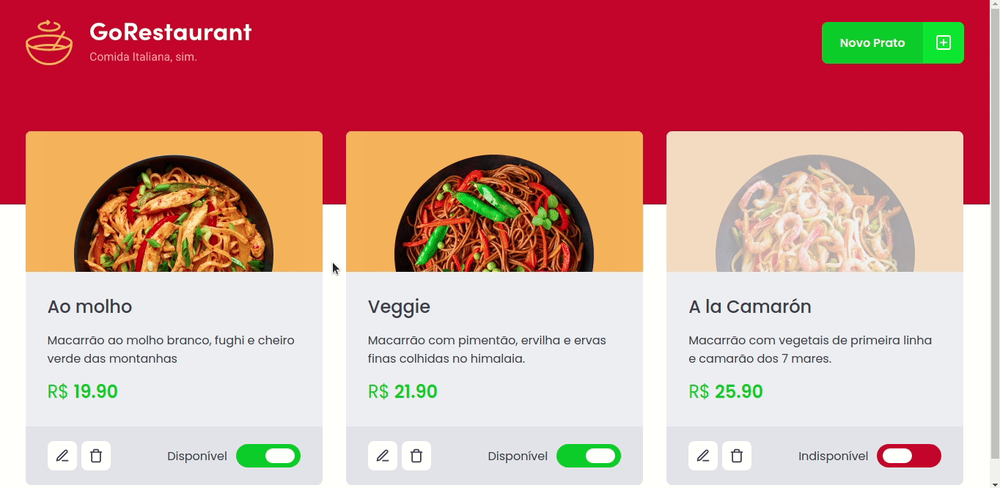

	

	<h1>Change JavaScript application to TypeScript</h1>

### Summary

- [About the challenge](#about-the-challenge)

- [Final Result](#final-result)

### About the challenge

- A website of a restaurant foods. The challenge was change all .js files into .ts files, and class components into function components. [Click here](https://github.com/felipejsborges/ignite-2th-challenge-reactjs-complementary/commit/a9f5ae13a7f463bdf64e744e2152d9420974dfbf) to see the implementation.

### Final Result
 

	
	

by Felipe Borges 
[LinkedIn](https://www.linkedin.com/in/felipejsborges) | [GitHub](https://github.com/felipejsborges)
